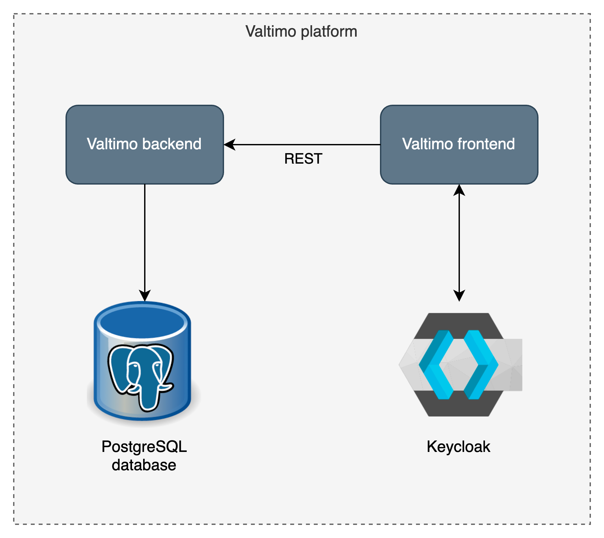

## Welcome to Valtimo

### What is Valtimo?
Valtimo is the low-code platform for Business Process Automation. Our goal is to make implementing business process automation and case management easy.

### What does the Valtimo platform contain?
- Valtimo consists of two services:
    - A Spring Boot Java/Kotlin backend
    - An Angular frontend
- Valtimo depends on two services:
    - Keycloak as an identity and access provider
    - A database (default is PostgreSQL)

### What are the 'Valtimo backend libraries'?
This repository contains:
- A collection of Java/Kotlin libraries that together form the Valtimo backend.
- The `app:gzac` module, containing a Spring Boot application, used for library development.

### Starting the Valtimo platform
Starting up the Valtimo platform required three steps:
1. Starting the Valtimo backend. Instructions can be found [here](#starting-the-valtimo-backend-libraries-from-source).
2. Starting the Valtimo frontend. Instructions can be found [here](https://github.com/valtimo-platform/valtimo-frontend-libraries/#starting-the-valtimo-frontend-libraries-from-source)

### Starting the Valtimo backend libraries from source
#### Prerequisites
- Java 17
- [Docker (Desktop)](https://www.docker.com/products/docker-desktop/)
- (Optional) An IDE like [IntelliJ](https://www.jetbrains.com/idea/download/) or [Eclipse](https://www.eclipse.org/downloads/)

#### Start Application
Run the following command to start the Spring Boot application: `./gradlew :app:gzac:bootRunWithDocker`.

### Test users
Keycloak management can be accessed on http://localhost:8081 with the default credentials of username <ins>admin</ins> and password <ins>admin</ins>.

Keycloak comes preconfigured with the following users.

| Name         | Role           | Username  | Password  |
|--------------|----------------|-----------|-----------|
| James Vance  | ROLE_USER      | user      | user      |
| Asha Miller  | ROLE_ADMIN     | admin     | admin     |
| Morgan Finch | ROLE_DEVELOPER | developer | developer |

### Code quality
#### Running tests
- Run the following command to run the unit tests: `./gradlew test`.
- Run the following command to run the integration tests using a PostgreSQL database: `./gradlew integrationTestingPostgresql`.
- Run the following command to run the integration tests using a MySQL database: `./gradlew integrationTestingMysql`.
- Run the following command to run the security tests: `./gradlew securityTesting`.

### Contributing
Contributions are welcome! To get you in the right direction, please consult the [Valtimo documentation](https://docs.valtimo.nl/readme/contributing) for guidelines on how to contribute.

#### Code guidelines
<!--- TODO: write the coding guidelines--->
For contributing code, please refer to the [coding guidelines](CODING-GUIDELINES.md).

#### Branching strategy
For more information on what branches to create while working in this project, please refer
to [this page](https://github.com/valtimo-platform/valtimo-documentation/blob/next-minor/contributing/branching-and-release-strategy.md).
<!--- TODO: change url --->

### License
The source files in this repo are licensed under the [EUPL 1.2](https://joinup.ec.europa.eu/collection/eupl/eupl-text-eupl-12).
If you have any questions about the use of this codebase in a larger work: please reach out through the [Valtimo website](https://www.valtimo.nl/contact/).

### More information
- Website: https://www.valtimo.nl
- Documentation: https://docs.valtimo.nl